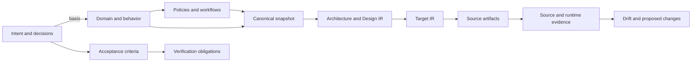
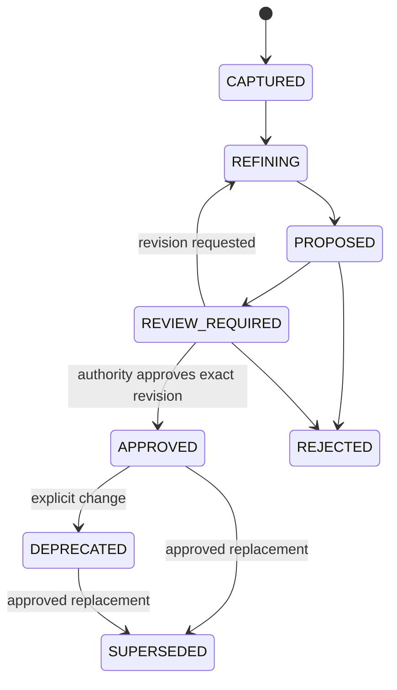

# ACP meta-model

Status: normative Phase 1 kernel and explicit extension proposals. Version: `0.1.0`. This version is experimental, not a stable interchange promise. [Schema](../contracts/kernel.schema.json) defines closed record shapes; this document defines their meaning. [Coverage](coverage.md) identifies enforcement limits.

## 1. Model boundaries and notation

`Ref<T>` means an exact `(id, revision)` reference to kind T inside the same application's snapshot. `T[]` is an ordered list unless declared a set. `T[1..*]` is nonempty. Absence differs from null; null is not a kernel value. All unspecified properties and semantic kinds are errors, including framework-specific extension fields.

The executable kernel contains authoring candidates as well as approved nodes. It is **not itself Canonical IR**. A `compile` validation profile checks necessary approval closure; only a future authority-verifying normalization pass can produce Canonical IR.

## 2. Snapshot, identity, and shared record

Snapshot = `{modelVersion, applicationId, snapshotId, nodes, approvals, issues}`. Application and snapshot IDs are opaque tokens. The fixture represents one application boundary; it is not a storage transaction or content-addressing format.

Every Node has:

| Property | Type/cardinality | Contract |
| --- | --- | --- |
| id | ID, 1 | `[A-Za-z][A-Za-z0-9._:-]*`, at most 128 characters; unique within snapshot/application; never reused |
| revision | positive integer, 1 | Immutable version, at most 2^53−1 in fixtures; updates create next revisions |
| kind | closed discriminator, 1 | Determines the data shape; cannot be changed under an existing ID |
| name | nonblank string, 1 | Mutable display name; not a lookup key |
| lifecycle | enum, 1 | Authoring/approval/retirement state below |
| steward | nonblank principal reference, 1 | Responsible editor/team; not proof of approval authority |
| origins | Origin[1..*] | `{source, locator, actor, actorType}`; actorType HUMAN, AI, or IMPORT; source/locator are opaque evidence locators and never fetched by validation |
| basis | Ref<Requirement or Decision> set, 0..* | Nonempty for all non-intent kinds; cannot justify itself; dependencies retain exact revisions |
| supersededBy | Ref<same kind>, 0..1 | Required only in SUPERSEDED; replacement must be another active revision identity |
| data | typed record, 1 | No generic attributes/extension bag |

All reference-valued arrays in the kernel are sets: no duplicates and no semantic ordering. Node and approval array order also carries no meaning. Expression operand order is semantic; future ordered workflow steps must declare their ordering explicitly. Basis links must be acyclic. A rename changes a node revision and name, preserves ID/kind, updates exact references, and invalidates affected evidence. Source locations and names never allocate identities. Cross-snapshot history and allocation collision policy are Phase 3 contracts.

## 3. Lifecycle and approval

The diagram is the transition contract, not an implemented transition engine. Imported candidates begin CAPTURED; synthetic fixtures may represent later states. Changes to approved content create a new PROPOSED revision while the prior approved snapshot remains immutable. Rejected/superseded records remain in history. Reopening requires a new revision. Deprecation preserves obligations through the compatibility window.

Approval is an attestation to an exact subject revision, reviewer, and evidence locator. Kernel checks require matching records for APPROVED/DEPRECATED nodes; all approval subjects must resolve. The real approval port must authenticate reviewer authority, bind a content/change digest, verify trust and revocation, and enforce separation of duties. Strings in a fixture prove none of those properties.

IMPLEMENTED, VERIFIED, and RELEASED are derived from fresh artifact/evidence records. BLOCKED is a gate/work observation. Neither a successful test nor AI authorship changes lifecycle. All nodes in a selected compile snapshot must be APPROVED or DEPRECATED. No rejected, unresolved, or proposal dependency may be smuggled into that snapshot.

## 4. Intent kinds

Every intent kind has `statement: nonblank string`. Origins are mandatory even when basis is empty. Statement text is preserved, not interpreted as executable logic.

| Kind | Additional required data | Semantics |
| --- | --- | --- |
| Fact | evidence: string | Observed assertion with evidence; revisitable, not an executable constraint |
| Constraint | subjects: Ref<Node>[1..*] | Mandatory restriction on subjects; formalization needed before enforcement can be claimed |
| Requirement | priority: MUST/SHOULD/COULD; acceptance: Ref<AcceptanceCriterion>[1..*] | Desired observable behavior; each criterion must point back to this requirement |
| Preference | rationale: string | Soft preference; override requires recorded decision |
| Goal | measure: string | Optimization objective with a stated measure; never overrides a constraint |
| Assumption | reviewTrigger: string | Explicit uncertainty; must be revisited on trigger |
| Decision | strength: PREFERRED/REQUIRED/LOCKED; rationale: string; alternatives: string[1..*] | Chosen direction with provenance; LOCKED requires explicit replacement/change approval |

Constraint contradictions cannot be inferred reliably from arbitrary prose. Explicit `issues` retain known ambiguity/conflict records with semantic subjects. A resolved issue requires a referenced approved Decision; a blocking OPEN issue prevents compile validation. General logical contradiction detection remains proposed, and absence of a detected issue is not proof of consistency.

## 5. Executable domain and behavior kernel

Shared fields and basis/origins apply to every row. All references below are exact and kind checked.

| Kind | Required data and cardinality | Additional invariants |
| --- | --- | --- |
| Entity | identity: Ref<Field>[1..*]; tenantField?: Ref<Field> | Identity/tenant fields belong to entity and are required; identity fields use Identifier<this Entity>; tenant field uses Identifier<tenant Entity> |
| Field | owner: Ref<Entity>; type: Type; optional: Boolean; classification: PUBLIC/INTERNAL/SENSITIVE/SECRET | Field ownership is exactly one entity; SECRET requires SecretReference; no inline secret material |
| Parameter | type: Type; value: LiteralValue | Literal conforms to semantic type; changing value is a semantic change |
| Invariant | resource: Ref<Entity>; predicate: Expression; enforcement: set of WRITE/TRANSITION/READ/EXPORT | Predicate is Boolean; nonempty enforcement declares required semantic checkpoints, not SQL/framework mechanisms |
| Command | resource: Ref<Entity>; invariants: Ref<Invariant>[]; emits: Ref<Event>[] | Invariants/events have the same resource; absence of policy is default denial at runtime, never public permission |
| Event | resource: Ref<Entity>; payload: Ref<Field>[] | Payload fields belong to resource; an event is a fact, not a broker or delivery mechanism |
| Actor | subject: Ref<Entity> | Describes caller identity domain; authentication realization is separate |
| Role | actor: Ref<Actor> | Role describes an assignable permission grouping; assignment itself is not implemented |
| Policy | actor: Ref<Actor>; roles: Ref<Role>[1..*]; resource: Ref<Entity>; action: Ref<Command>; effect: ALLOW/DENY; predicate: Expression | Roles belong to actor; action belongs to resource; Boolean predicate; actor/resource bindings checked |
| StateMachine | resource: Ref<Entity>; initial: Ref<State> | At least one state by inverse ownership; initial belongs to this machine |
| State | machine: Ref<StateMachine>; terminal: Boolean | State belongs to exactly one machine |
| Transition | machine: Ref<StateMachine>; from/to: Ref<State>; command: Ref<Command>; actor: Ref<Actor>; guard: Expression; effects: Ref<Event>[] | Both endpoints belong to machine; command/events share machine resource; Boolean guard; no outgoing transition from terminal state |
| AcceptanceCriterion | requirement: Ref<Requirement>; scenario: string | Requirement's acceptance set contains this criterion; scenario is desired evidence, not a passing test |

Policy evaluation contract: no matching ALLOW means deny; a matching DENY overrides ALLOW. A tenant-owned resource requires an explicit policy scope; the kernel does not prove tenant isolation, conflict freedom, or enforcement coverage. The compiler must discharge these before lowering. Duplicate `(machine, from, command)` triggers are rejected by this kernel, even with different guards; general guard disjointness/priority needs a separate approved design. States must be graph-reachable from the initial state, ignoring guards; reachability is not proof that guards are satisfiable. Transitions preserve legal effects; execution order/delivery guarantees are not inferred from list order.

## 6. Type and expression algebra

Kernel Type is one of `Boolean`, `String`, `Integer`, `Decimal`, `Email`, `DateTime`, `SecretReference`, `Identifier<EntityRef>`, or `Money<currency>`. Currency is an uppercase three-letter token; a future versioned currency registry must validate actual membership. Decimal/Money literal values are decimal strings, never binary floating-point. Integer literals use canonical integer strings. Money does not imply a rounding/scale policy; arithmetic requiring rounding must wait for an approved policy.

Identifier carries its entity type. Email and DateTime remain distinct from String; lexical validation for them is not implemented in this kernel. SecretReference is a symbolic handle, never a credential; kernel literals use `secret:` followed by an ASCII letter and letters/digits/`._:/-`. No automatic primitive erasure, currency conversion, nullable coercion, time-zone conversion, or arbitrary host-language expression is allowed.

Expression is a closed tagged union:

| Tag | Inputs | Result / rule |
| --- | --- | --- |
| literal | type, value | Declared type after literal validation |
| parameter | ref: Ref<Parameter> | Parameter's type |
| field | binding: resource/actor; ref: Ref<Field> | Field's type; owner must match binding context; optional reads rejected until explicit presence/narrowing is designed |
| binary | op, left, right | `eq`: same comparable type → Boolean; `gt`: same Integer/Decimal/Money type → Boolean; `add`: same Integer/Decimal/Money type → same type; `and`: Boolean × Boolean → Boolean |

SecretReference cannot participate in comparisons. Identifier equality requires identical target entity/revision. Money equality, comparison, and addition require identical currency. Predicates/guards must return Boolean. Expressions are pure: no clock, network, filesystem, random value, secret resolution, SQL, or service calls. Expression nesting is limited by the harness; production resource budgets must be explicit. General quantification, collections, relations, null narrowing, conversion, aggregate consistency, and effect ordering remain P-01.

## 7. Extension proposals (not accepted executable shapes)

Every future durable concept inherits identity, lifecycle, origin, basis, steward, and exact-reference contracts. Each row is a proposed bounded model with minimum relationships and admission criteria. Unknown kinds are rejected today rather than pretending to support them.

| Boundary / concepts | Proposed fields and relations | Required admission evidence |
| --- | --- | --- |
| Domain: ValueObject, Relation, Aggregate | ValueObject owns typed fields, value equality; Relation has entity endpoints, cardinalities, optionality, inverse/deletion policy; Aggregate has one root entity, members, invariants | Cyclic containment rejection, identity vs value equality, transaction consistency, cascade/migration cases (P-01) |
| Domain: semantic type registry | PhoneNumber, URL, Percentage, Date, Duration, Timezone, CountryCode, CurrencyCode, File, Image, GeoPoint, NationalIdentifier, Version; refinements reference versioned validators | Exact lexical/semantic domains, units/precision, locale independence, safe narrowing and target representation tests (P-01) |
| Security: AuthenticationModel, Permission, Scope, DataClassification, SessionPolicy, RateLimit | Actor identity proof; permission binds action/resource; scope binds record/tenant expressions; classification drives audit/encryption/exposure/redaction; session/rate rules reference actors/actions | Tenant bypass/deny/role conflict/export tests; secret-safe diagnostics; provider-independent semantics (P-02) |
| Privacy: Retention, LegalHold, Deletion, Anonymization, ExportRule | Data subjects and classifications, duration/trigger, hold precedence, permitted transformations, immutable records | Delete-vs-retain conflicts, legal-hold precedence, migration and audit evidence (P-02) |
| Application: UseCase, Service, Query, Transaction, Job | UseCase orchestrates commands/queries; Service is logical boundary; Query has projection/scope/pagination; Transaction binds consistency/participants; Job has trigger/retry/idempotency/deadline | Explicit failures/compensation, duplicate delivery, concurrency, timeout and consistency tests (P-03) |
| Workflow: Guard, Effect | Reusable typed pure guard; effect refers to command/event/state update with order and delivery intent | No implicit calls; overlapping guard analysis and exactly stated delivery guarantees (P-03) |
| Interface: API, Screen, Form, Table, Search, Report, Dashboard, Notification | API exposes use cases with compatibility intent; UI binds tasks/actions/view data and policy, not physical tables; notification defines audience/template/data/delivery requirement | API version coexistence; authorization parity for UI/API/export; accessibility/evidence mappings (P-04) |
| UX: ApplicationShell, Navigation, Page, Layout, Section, Wizard, Action, Filter, Modal, Metric, Chart, Empty/Loading/ErrorState, PermissionBoundary, ResponsiveRule | Typed composition tree; ordered wizard steps; semantic actions and explicit view states; labels, keyboard/focus behavior | Task-based flows, responsive behavior, focus/error paths, no database-to-UI shortcut (P-04) |
| Design IR: Tokens, Typography, Spacing, Components, Interaction | Realization references semantic UI identities, design system version, responsive/accessibility constraints | Same canonical UI intent with two design systems; preserve interactions/accessibility obligations (P-04) |
| Integration: ExternalSystem, Webhook, Queue, ScheduledJob, FileExchange | Boundary contract, schema versions, secret handles, delivery/idempotency/error/replay policy; semantic schedule and timezone | Duplicates/out-of-order delivery, compatibility, tampering, outage and clock cases (P-03) |
| Quality: TestRequirement, PerformanceRequirement, AccessibilityRequirement, ReliabilityRequirement, CompatibilityRequirement | Criterion/semantic subject refs, verification method, measurable thresholds, workload/environment, applicability | Fresh evidence tied to exact inputs; negative authorization cases and explicit manual evidence where automation is insufficient (P-05) |
| Operations: Environment, DeploymentProfile, Observability, Backup, Recovery, Retention, Scaling | Logical topology, configuration/secret bindings, health/log/metric/audit needs, RPO/RTO and restore obligations | Secret isolation, redaction, restore exercise, measured performance, deployment/runtime drift (P-05) |

See [ADR-0005](adr/0005-open-architecture.md) for options, recommendations, consequences, and blocked work. Business defaults such as fees, currencies, legal retention durations, tenant hierarchy, or cloud topology must come from the application specification, never from these examples.

## 8. Validation order

Strict input decoding → closed shape/version → identity index → reference resolution/kinds/revisions → semantic checks (ownership/types, workflow/acceptance, basis/lifecycle/approval/issues). Invalid structure stops dependent passes. Invalid references suppress dependent type errors. Independent semantic errors may accumulate in stable order. Input files are capped at 1 MiB and 48 nesting levels; JSON numeric literals must be integers, while domain Integer/Decimal/Money literal values are strings. A kernel-valid draft can contain proposals; a kernel-valid compile candidate still needs trusted approval, full semantic coverage, normalization, and later production gates.
